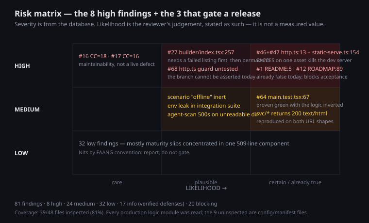

# Code review — `@theokit/studio`

**Target:** `packages/studio` · 57 files / 4,960 LoC inventoried · **Mode:** full (5 phases)
**Findings:** 81 — 0 critical, 8 high, 24 medium, 32 low, 17 info
**Coverage:** 39/48 non-excluded files inspected (81%)
**Quality gates:** phase 2 — 0.80 · phase 3 — 0.88 · phase 4 — 0.82 · all PASS, **zero discards**

*(The engagement banner reported 5,118 LoC across 55 files; this review's own
inventory counts 57 files / 4,960 LoC because it also registers `.md`/`.css`/`.html`
and applies its own exclusion rule. The inventory is the figure used throughout.)*

---

## Verdict

This is competent senior-level code with a real architecture: a DIP seam with two
adapters and a single composition root, typed domain errors, boundary validation,
six injected test seams, and 95.65%/89.46% measured coverage with no mocking
framework at all. Nothing here reads as careless.

The findings cluster into three groups, and they are not equally urgent:

1. **One defect can kill the user's dev server.** It is deterministic, not a race,
   and it lives in the one branch the test suite never enters.
2. **The documentation now describes a product that was deleted one commit ago** —
   including the ROADMAP bullets that this project's own acceptance cycle reads as
   pass/fail criteria.
3. **Everything else is maintainability**, concentrated almost entirely in one
   509-line component.

There is no critical finding. The high ones are cheap to fix — the headline is a
one-word change plus a two-line reorder.



---

## The eight high findings

| # | Finding | Where | Why it matters |
|---|---|---|---|
| 46 | Error envelope ignores `res.headersSent` | `plugin/http.ts:13` | Any post-header throw becomes an unhandled rejection → **process exit** |
| 47 | Asset read runs *after* the 200 head is committed | `plugin/static-serve.ts:154` | The reachable trigger for 46. `EACCES` fires it **deterministically** |
| 68 | That guard branch is never entered by any test | `plugin/static-serve.test.ts:48` | 100% statements, 50% branch — the dangerous branch is the uncovered one |
| 27 | `openError` is permanently masked by `loadError` | `src/pages/builder/index.tsx:257` | Guard uses `\|\|`, body uses `??`; user never sees build-session failures |
| 1 | README advertises five deleted surfaces | `../../README.md:5` | The first thing a new adopter tries does not exist |
| 12 | ROADMAP DoD bullets became unsatisfiable | `../../ROADMAP.md:89` | `cycle-acceptance` reads them verbatim — M1/M2/M3 cannot be accepted |
| 16 | `handleAgentRun` CC=18 | `plugin/run-endpoint.ts:137` | Highest measured complexity; maintainability, not a live defect |
| 17 | `SessionView` CC=16 | `src/pages/builder/session-view.tsx:66` | Combinatorial pane-state, not deep control flow |

### The crash chain, in full

```ts
// plugin/http.ts:13 — the guard asks "is it finished?", not "is the head committed?"
if (res.writableEnded || res.destroyed) return;
res.writeHead(status, { "Content-Type": "application/json" });

// plugin/static-serve.ts:154 — commits the head, THEN does the throwing read
res.writeHead(200, { "Content-Type": CONTENT_TYPES[ext] ?? "application/octet-stream" });
res.end(readFileSync(safe.path));
```

`readFileSync` throws `EACCES` → the catch calls `sendErrorEnvelope` → its guard
passes (`headersSent=true` but `writableEnded=false`) → `writeHead` throws
`ERR_HTTP_HEADERS_SENT` inside a `.catch()` → Node 22 exits.

This was **reproduced twice independently** — once by the reviewer on Node
v22.22.2, once by the quality gate against the real `serveStudio` (exit code 1).
The gate also corrected the reviewer: the trigger was described as a TOCTOU race,
but `EACCES` fires after `existsSync` and `statSync` both pass, so a single
unreadable asset kills the server on *every* request. `serveIndexWithConfig` reads
*before* committing (`:85→:98`) — the asset path is the lone outlier in its own file.

---

## Remediation plan

Ordered by (impact ÷ effort). Efforts are rough and assume someone who knows the code.

| # | Action | Files | Effort |
|---|---|---|---|
| 1 | Add `res.headersSent` to both guards; swap read/commit order in the asset branch | `plugin/http.ts:13,20` · `plugin/static-serve.ts:154` | **~10 min** |
| 2 | Add `plugin/http.test.ts` covering a committed-response call; give the three fakes a `headersSent` property so the guard is assertable | `plugin/http.test.ts` (new) + 3 harnesses | ~45 min |
| 3 | Fix the error slot: use one operator, and clear `loadError` on a new run | `builder/index.tsx:257` · `use-listing.ts:30` | ~15 min |
| 4 | Restore the discriminating assertions to the live-mode test (assert reflection-only data is present *and* fixture data is absent) | `src/main.test.tsx:67` | ~15 min |
| 5 | Rewrite README hero + feature table for the single-surface product | `../../README.md` | ~30 min |
| 6 | Reconcile ROADMAP M1/M2/M3 DoD with the delivered scope | `../../ROADMAP.md` | needs a product decision |
| 7 | Return a typed 404 for `/_studio/svc/*` instead of SPA HTML | `plugin/index.ts:98` | ~20 min |
| 8 | Drop `scenario:"offline"`, the dead `reload()`, the four unemitted counters, and the false lint warrant | 4 files | ~20 min |
| 9 | Replace the decorator spread with three explicit delegations | `reflection-datasource.ts:50` | ~10 min |
| 10 | Split the two multi-behaviour tests; drop CSS-literal assertions | `builder.test.tsx:57,137,215` | ~40 min |

Items 1–4 are the ones worth doing before the next release. Item 6 is not an
engineering task — it is a decision about whether the roadmap or the code is wrong.

---

## What was verified as *working*

17 `info` findings record defenses that hold, so this report says what was checked,
not only what failed:

- **Path traversal** (`static-serve.ts:64`) — decode → NUL check → normalize →
  prefix. Tested with hostile input.
- **Cross-origin check runs before any token-spending work** (`run-endpoint.ts:159`).
- **The URL agent name never reaches the filesystem** — it is looked up in the
  already-scanned set (`run-endpoint.ts:173`).
- **No HTML injection** in error rendering — `textContent`/JSX, config escapes `<`.
- **`bootstrap().catch(() => {})` is a deliberate duplicate-report suppressor**, not
  a swallowed error.
- **Six plugin components** carry explicit no-issues completeness verdicts.
- **DNS rebinding investigated and deliberately not filed** — Vite's
  `hostValidationMiddleware` runs before `configureServer`. Only the honest residue
  was filed: the plugin depends on a second layer it never documents.

---

## Notable: where measurement beat intuition

**The 510-line file is the least dense code in the package.** Phase 1 flagged
`builder/index.tsx` as "the natural complexity hotspot" on size alone. Measured
with ESLint's McCabe implementation over 162 functions:

| Function | CC | Branches/line |
|---|---:|---:|
| `serveStudio` (~50 lines) | 14 | **0.280** |
| `parseStudioConfig` (~49 lines) | 13 | **0.265** |
| `AgentBuilderPage` (351 lines) | 15 | **0.043** |

`serveStudio` packs six times the decision density into a tenth of the lines. The
LoC signal pointed at the wrong file, and the baseline's hypothesis was wrong.

---

## How this review policed itself

Every phase was gated by an independent adversarial evaluator that re-opened cited
files, re-ran greps and tools, and hunted for what the phase missed. **Zero of 81
findings were discarded** — but the gates changed the outcome four times:

- Phase 2 shipped with 5 findings; the gate found **3 more**, including the
  ROADMAP drift that blocks the acceptance cycle — the highest-consequence
  documentation finding in the report.
- Phase 3's crash finding was **raised** medium → high after the gate proved the
  trigger deterministic; a second finding was raised after the gate found the root
  cause (`use-listing.ts:30`) that four specialists had walked past.
- Phase 4's most damning finding is about **a test the reviewer wrote during the
  refactor under review**. The gate did not take it on faith: it inverted the
  production ternary, watched all three tests stay green, restored the file, and
  verified a clean tree.
- Phase 4's pyramid arithmetic was wrong (112 ≠ 119) and three axes were declared
  clean without being measured. All corrected.

Two reviewer errors are recorded in the phase write-ups rather than quietly fixed:
a coverage-status overstatement in phase 2 (files marked `inspected` that had only
been scanned — reclassified to `sampled`), and a bulk `UPDATE` in phase 4 that hit
the wrong row and was caught by reading the result back.

---

## What was NOT reviewed

- **Runtime behaviour beyond the reproductions above.** No profiling, no load
  testing, no manual exercise of the UI.
- **Dependencies.** No CVE audit, no supply-chain review, no license check. `pnpm`
  lockfile untouched.
- **The 9 excluded files** (`tests/fixtures/demo-project/**`) — they are contract
  *input* for `agent-scan`, not reviewable source.
- **9 uninspected files** — all config/manifest (`package.json`, `vite.config.ts`,
  `tailwind.config.js`, `index.html`, `src/index.css`, `src/test/setup.ts`,
  `tsup.config.ts`, `vitest.config.ts`, `src/vite-env.d.ts`). **No production logic
  module was left unread.**
- **The two files outside the target** (`README.md`, `ROADMAP.md`) were read only
  where they make claims about this package.
- **`/_studio/svc/*` as a feature** — its absence is scheduled M2/M3 work, not
  drift. Only its wrong *response shape* was filed.
- **Accessibility, i18n, and visual design** — outside the requested scope.

---

## Artifacts

| Path | Contents |
|---|---|
| `code-review.db` | 81 findings, 24 components, 57 inventoried files, 16 test-audit rows, 3 quality gates |
| `baseline/architecture_map.md` | Two-runtime map, entry points, five trust boundaries |
| `baseline/component_inventory.md` | 24 components with responsibilities |
| `findings/completeness/phase2_completeness.md` | Doc drift + post-refactor residue |
| `findings/code/phase3_code_review.md` | The crash chain, complexity measurements, pattern verdicts |
| `findings/test/phase4_test_audit.md` | Pyramid, the branch-coverage intersection, the weakened test |
| `figures/risk_matrix.svg` | Severity × likelihood |
